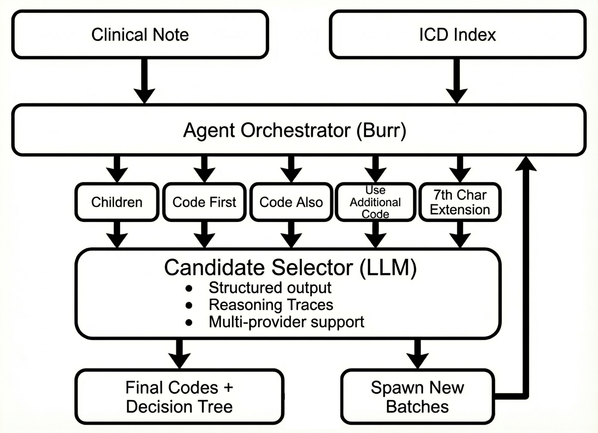

# TMSP - Test for Medical Stepwise Predictions

A framework for evaluating LLM medical domain understanding through hierarchical ICD-10-CM code traversal.

## Overview

TMSP tests the consistency and accuracy of medical knowledge in language models by guiding them through a **stepwise decision tree** rather than asking for direct answers. Instead of prompting "What ICD-10 codes apply to this patient?", the system presents a series of 0..n candidate selection questions at each level of the medical coding hierarchy.

This long-horizon approach reveals *how* an LLM reasons through sequential medical decisions, not just *what* codes it produces.

## The Problem with Direct Medical Coding

Traditional LLM evaluation asks models to produce final ICD-10-CM codes directly. This has several limitations:

- **Black box reasoning**: No visibility into the decision process
- **Inconsistent specificity**: Models may skip hierarchy levels arbitrarily
- **Missing lateral codes**: Comorbidities and "code also" relationships are often ignored
- **Unverifiable confidence**: No way to assess certainty at each decision point

## The Stepwise Solution

TMSP decomposes medical coding into a traversal problem:

```
Clinical Note: "65yo male with type 2 diabetes, presenting with diabetic retinopathy"

Step 1: Which ICD-10 chapters are relevant?
   [ ] Chapter 1: Infectious diseases
   [ ] Chapter 2: Neoplasms
   [ ] Chapter 3: Blood disorders
   [x] Chapter 4: Endocrine disorders      ← LLM selects
   [ ] Chapter 5: Mental disorders
   ...

Step 2: Within Endocrine (E00-E89), which subgroups or code blocks are relevant?
   [ ] E00-E07: Thyroid disorders
   [x] E08-E13: Diabetes mellitus           ← LLM selects
   [ ] E15-E16: Other glucose regulation
   ...

Step 3: Within Diabetes (E08-E13), what are the relevant category/categories?
   [ ] E08: Diabetes due to underlying condition
   [ ] E09: Drug-induced diabetes
   [ ] E10: Type 1 diabetes mellitus
   [x] E11: Type 2 diabetes mellitus        ← LLM selects
   [ ] E13: Other specified diabetes
   ...

Step 4: Within E11, which manifestations?
   [x] E11.3: With ophthalmic complications  ← LLM selects
   ...

... continues until terminal codes reached ...

Final Output: E11.319 (Type 2 diabetes with unspecified diabetic retinopathy)
```

At each step, the LLM must:
1. Evaluate candidates against clinical context
2. Provide reasoning for selections
3. Handle relationship types (children, codeFirst, codeAlso, useAdditionalCode)

## How It Improves Medical Domain Understanding

### 1. Granular Error Detection

When an LLM fails, TMSP shows *where* it failed:

```
✓ Correctly identified Endocrine chapter
✓ Correctly selected E11 (Type 2 diabetes)
✗ Failed at E11.3x level - selected E11.65 (hyperglycemia) instead of E11.3x (ophthalmic)
```

This pinpoints knowledge gaps: the model understands diabetes exists but misclassifies its manifestations.

### 2. Reasoning Transparency

Each selection includes LLM reasoning:

```json
{
  "batch_id": "E11|children",
  "selected": ["E11.3"],
  "reasoning": "Patient has documented diabetic retinopathy, which is an ophthalmic
               complication. E11.3x covers diabetes with ophthalmic complications."
}
```

Poor reasoning reveals conceptual misunderstandings even when selections are correct.

### 3. Lateral Relationship Handling

ICD-10-CM includes metadata relationships:
- **codeFirst**: Underlying condition should be coded first
- **codeAlso**: Additional codes that commonly co-occur
- **useAdditionalCode**: Supplementary codes for complete picture

### 4. Specificity Progression

Medical coding requires drilling down to the most specific applicable code. TMSP tracks whether models:
- Stop too early (insufficiently specific)
- Go too deep (overly specific without evidence)
- Handle 7th character requirements (laterality, encounter type)

### 5. Consistency Testing

Running the same clinical note multiple times with identical LLM settings reveals:
- **Robustness**: The candidate selections that remain invariant
- **Sensitivity**: The decision points causing variability across runs
- **Grounding**: Whether selections reflect appropriate medical reasoning

## Zero Shot Mode

In addition to stepwise traversal, TMSP supports **zero-shot code generation** for comparison:

| Aspect | Scaffolded Traversal | Zero Shot |
|--------|---------------------|-----------|
| Approach | Hierarchical tree traversal with selection at each level | Direct code generation in single LLM call |
| Transparency | Full decision tree with reasoning at each step | Single reasoning explanation |
| API Flag | `scaffolded: true` (default) | `scaffolded: false` |

Zero-shot mode is useful for:
- **Baseline comparisons**: Compare scaffolded accuracy against direct generation
- **Speed**: Single LLM call vs. multiple hierarchy traversals
- **Traditional evaluation**: When you just need final codes without decision trace

## Traversal Tools

The web frontend includes three interactive tabs:

**Visualize** lets you enter ICD-10-CM codes and see the minimal connected graph that links them to a common root. This is useful for understanding how codes relate through the hierarchy and lateral relationships (codeFirst, codeAlso, useAdditionalCode).

**Traverse** runs the stepwise traversal on a clinical note and streams the decision tree in real-time. You can watch the LLM navigate through the hierarchy, see its reasoning at each step, and use Rewind to correct any mistakes.

**Benchmark** compares LLM traversal results against expected codes. You provide a clinical note and the codes you expect, then run the traversal to see which codes were matched, missed, or overshot.

## Architecture



### Components

| Module | Purpose |
|--------|---------|
| `agent/` | Burr-based state machine for traversal orchestration |
| `candidate_selector/` | LLM integration with structured outputs |
| `graph/` | ICD-10-CM index and hierarchy utilities |
| `server/` | FastAPI backend with SSE streaming |
| `frontend/` | React visualization of traversal trees |

## Caching

TMSP implements two-layer caching to avoid redundant LLM calls:

### Cross-Run Persistence

Results are cached in SQLite based on a deterministic key derived from:
- Clinical note text
- Provider and model
- Temperature
- System prompt (if custom)

Separate tables store scaffolded (`burr_state`) and zero-shot (`zero_shot_state`) results.

### In-Memory Selector Cache

During a single traversal, identical selection requests return cached results. This ensures consistency when the same batch is encountered in parallel branches.

## Installation

### Backend

```bash
# Core dependencies
uv sync

# With server (FastAPI + uvicorn)
uv sync --extra server
```

### Frontend

Requires Node.js (v18+).

```bash
cd frontend
npm install
npm run build
```

## Usage

### Run the Server

```bash
uv run tmsp-server
```

The application runs at `http://localhost:8000`.

To use a different port:

```bash
uv run tmsp-server --port 8080
```

### Programmatic API

#### Visualize

```python
from graph import build_graph

result = build_graph(
    codes=["E11.65", "N18.3"],
)

print(result["nodes"])          # set of all nodes in the graph
print(result["tree"])           # dict mapping parent -> set of children
print(result["leaves"])         # the original input codes
print(result["lateral_links"])  # list of (source_node, anchor_code, key)
```

#### Traverse

```python
from agent import run_traversal

result = await run_traversal(
    clinical_note="Patient with type 2 diabetes and chronic kidney disease stage 3",
    provider="vertexai",
)

print(result["final_nodes"])  # ['E11.65', 'N18.3']
print(result["batch_data"])   # Full decision tree with reasoning
```

#### Zero-Shot

```python
from agent import run_zero_shot

codes, reasoning, was_cached = await run_zero_shot(
    clinical_note="Patient with type 2 diabetes and chronic kidney disease stage 3",
    provider="vertexai",
    model="gemini-2.5-flash",
    temperature=0.0,
)

print(codes)      # ['E11.65', 'N18.3']
print(reasoning)  # Full reasoning explanation
```

#### Benchmark

```python
from agent.benchmark import run_benchmark

code_metrics, path_metrics = await run_benchmark(
    clinical_note="Patient with type 2 diabetes and chronic kidney disease stage 3",
    expected_codes=["E11.65", "N18.3"],
    provider="vertexai",
)

print(f"Recall: {code_metrics['recall']:.2%}")
print(f"Missed: {code_metrics['missed']}")
print(f"Undershoot: {code_metrics['undershoot']}")
```

Zero-shot benchmark:

```python
code_metrics, path_metrics = await run_benchmark(
    clinical_note="...",
    expected_codes=["E11.65", "N18.3"],
    provider="vertexai",
    model="gemini-2.5-flash",
    scaffolded=False,
)
```

## Supported LLM Providers

| Provider | Structured Output | Notes |
|----------|-------------------|-------|
| OpenAI | strict=true | Full JSON schema compliance |
| Anthropic | json_schema | Via anthropic-beta header |
| Vertex AI | responseSchema | Gemini models via API key or ADC |
| Cerebras | strict=true | 5000 char schema limit |
| SambaNova | best-effort | No strict mode |

## Evaluation Metrics

The Benchmark tab computes metrics comparing expected codes against traversal results:

- **Exact Match**: Expected code was finalized by the traversal
- **Undershoot**: Ancestor of expected code was finalized (stopped too early)
- **Overshoot**: Descendant of expected code was finalized (went too deep)
- **Missed**: Expected code has no relationship to any finalized code
- **Traversal Recall**: Fraction of expected trajectory nodes visited
- **Final Codes Recall**: Fraction of expected codes exactly matched

Lateral relationships (codeFirst, codeAlso, useAdditionalCode) are handled specially—if a lateral source is finalized, its target counts as matched.

## Rewind and Feedback

Checkpoint persistence enables targeted correction without full re-traversal:

### retry_node() API

Fork from any batch checkpoint and inject corrective feedback:

```python
from agent import retry_node

result = await retry_node(
    batch_id="E11|children",
    feedback="Select E11.3 for ophthalmic complications, not E11.65",
    selector="llm",
)
```

### REST Endpoint

```
POST /api/traverse/rewind
{
  "batch_id": "E11|children",
  "feedback": "Select E11.3 for ophthalmic complications",
  ...
}
```

This tests whether LLMs can incorporate corrective feedback—a key capability for medical AI systems.

## Planned Features

### Arena

An additional traversal tool, enabling head-to-head comparison of benchmark results across different LLMs. Run the same clinical notes through multiple providers and visualize:
- Accuracy differences at each hierarchy level
- Reasoning quality comparisons
- Consistency and specificity patterns across models

### Data Set Generation

Export traversal data into training-ready formats:
- **Fine-tuning datasets**: Candidate/selection pairs with reasoning traces
- **RL-friendly format**: Reward signals derived from benchmark outcomes (match/undershoot/overshoot)

Enables using TMSP traversals to improve medical coding models.

### Diagnosis Querying

Augment traversal with external clinical knowledge:
- Cross-reference clinical guidelines and evidence-based sources
- Hypothesize alternative or additional diagnoses
- Surface other coding (e.g. risk-adjustment) and CDI opportunities the LLM may have missed
